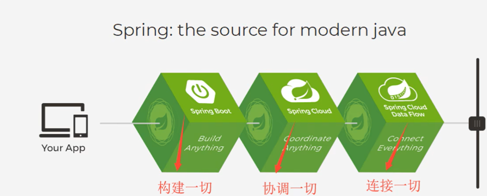

# Spring

## 简介

2002年，推出spring框架雏形，interface21

2004年，以interface21为基础，发布1.0版本

Rod Johnson ——Spring Framework创始人

理念：使现有的技术更加容易使用、本身是一个大杂烩，整合了现有的技术框架


+ SSH：Struct2 + Spring + Hibernate
+ SSM： SpringMVC + Spring + Mybatis

中文文档：https://www.docs4dev.com/docs/zh/spring-framework/5.1.3.RELEASE/reference

**官网**：https://spring.io/projects/spring-framework#learn

**git：**https://github.com/spring-projects/spring-framework.git

**Maven：**


```xml
<!-- https://mvnrepository.com/artifact/org.springframework/spring-webmvc -->
<dependency>
    <groupId>org.springframework</groupId>
    <artifactId>spring-webmvc</artifactId>
    <version>5.2.0.RELEASE</version>
</dependency>


<!-- https://mvnrepository.com/artifact/org.springframework/spring-jdbc -->
<dependency>
    <groupId>org.springframework</groupId>
    <artifactId>spring-jdbc</artifactId>
    <version>5.2.0.RELEASE</version>
</dependency>

```


+ 优点：开源免费框架(容器) 轻量级的、非入侵式的框架、==控制反转(IOC)、面向切面编程(AOP)==、支持事务的处理，支持对框架整合


​	**Sping就是一个轻量级的控制反转(IOC)、面向切面编程(AOP)的框架**


+ 组成


Spring 由七大模块组成，分别是Spring 核心容器（Spring Core）、应用上下文（Spring Context）、Spring面向切面编程（Spring AOP）、JDBC和DAO模块（Spring DAO）、对象实体映射（Spring ORM）、Web模块（Spring Web）以及MVC模块（SpringWebMVC）。


+ 拓展

现代化的java开发，基于Spring的开发




==SpringBoot==：快速开发的脚手架，基于SpringBoot可以快速开发单个微服务，约定大于配置

==SpringCloud==：基于SpringBoot实现


学习Springboot的前提，需要掌握Spring和SpringMVC


## IOC理论推导

1. UserDao接口
2. UserDaoImpl实现类
3. UserService业务接口
4. UserServiceImpl 业务实现类


在之前的业务中，用户的需求可能会影响我们原来的代码，需要根据用户的需求去修改原代码。如果程序代码量过大，修改操作繁琐成本大/


使用一个Set接口实现（革命性变化）

```java
 private UserDao userDao;

    //利用set进行动态实现值的注入

    public void setUserDao(UserDao userDao) {
        this.userDao = userDao;
    }
```

之前，程序是主动创建对象，控制权在程序员手上

使用了Set注入后，程序不再具有主动性，而是变成了被动的接收对象

这种思想，从本质上解决了问题，程序员不用再去管理对象的创建了。系统的耦合性大大降低，可以更加专注的在业务上的实现。这是IOC的原型

==分析：==


有多个DaoImpl实现类

以前业务层调用Dao层实现某个DaoImpl实现类，需要new出来，相当于写死了，再调用Dao层其他DaoImpl实现类，需要重新new出来。


采用Set接口


实现动态注入，每次调用不同Dao层Impl实现类时，用户（测试时）可以直接动态调用Set接口实现对应的Impl，不需要再在Service层修改代码


==IOC本质==


**控制反转IoC(Inversion of Control)，是一种设计思想，DI(依赖注入)是实现IoC的一种方法**，也有人认为DI只是IoC的另一种说法。没有IoC的程序中，我们使用面向对象编程，对象的创建与对象间的依赖关系完全硬编码在程序中，对象的创建由程序自己控制，控制反转后将对象的创建转移给第三方，所谓的控制反转就是：获得依赖对象的方式反转了


采用XML方式配置Bean的时候，Bean的定义信息是和实现分离的，而采用注解的方式可以把两者合为一体，Bean的定义信息直接以注解的形式定义在实现类中，从而达到了零配置的目的

控制反转是一种通过描述（XML或注解）并通过第三方去生产或获取特定对象的方式。在Spring中实现控制反转的是IoC容器，其实现方法是依赖注入（Dependency Injection，DI）

## HelloSpring


创建实体类

```java
public class Hello {
    private String str;

    public String getStr() {
        return str;
    }

    public void setStr(String str) {
        this.str = str;
    }

    @Override
    public String toString() {
        return "Hello{" +
                "str='" + str + '\'' +
                '}';
    }
}
```

编写配置文件

```xml
<?xml version="1.0" encoding="UTF-8"?>
<beans xmlns="http://www.springframework.org/schema/beans"
       xmlns:xsi="http://www.w3.org/2001/XMLSchema-instance"
       xsi:schemaLocation="http://www.springframework.org/schema/beans
        https://www.springframework.org/schema/beans/spring-beans.xsd">

    <!--使用Spring来创建对象，在Spring中这些都称为Bean
    类型 变量名 = new 类型（）
    Hello hello = new Hello（）

    bean 对象 new Hello()
    id = 变量名
    class = new 的对象
    property 相当于给对象的属性设置一个值

    -->
    <bean id="hello" class="com.lk.pojo.Hello">
        <property name="str" value="Spring"/>
    </bean>

</beans>
```

测试

```java
public class MyTest {
    public static void main(String[] args) {
        //获取Spring的上下文对象
        ApplicationContext context = new ClassPathXmlApplicationContext("beans.xml");
        //我们的对象现在都在Spring中管理，要使用，直接在里面取出来
        Hello hello = (Hello) context.getBean("hello");
        System.out.println(hello.toString());

    }
}
```


## IOC创建对象的方式

1 使用无参构造创建对象，默认的方式


2 使用有参构造创建对象

+ 下标赋值

```xml
    <!--第一种，下标赋值-->
    <bean id="user" class="com.lk.pojo.User">
        <constructor-arg index="0" value="lk"/>
    </bean>
```


+ 通过类型创建

```xml
    <!--第二种方式，通过类型创建，不建议使用-->
    <bean id="user" class="com.lk.pojo.User">
        <constructor-arg type="java.lang.String" value="lk"/>
    </bean>
```


+ 通过参数名

```xml
    <!--第三种，直接通过参数名来设置-->
    <bean id="user" class="com.lk.pojo.User">
        <constructor-arg name="name" value="lk"/>
    </bean>
```


在配置文件加载的时候，容器中管理的对象就已经初始化了

```java
    public static void main(String[] args) {
        ApplicationContext context = new ClassPathXmlApplicationContext("beans.xml");

        User user = (User) context.getBean("resu");
        user.show();
    }
```


用户不调用UserT实体，，但Spring中创建了UserT，UserT中的方法同样会加载

## Spring配置


### 别名

```xml
<alias name="user" alias="resu"/>
```

```java
  //通过别名resu 取USER
public static void main(String[] args) {
        ApplicationContext context = new ClassPathXmlApplicationContext("beans.xml");

        User user = (User) context.getBean("resu");
        user.show();
    }
```


### Bean的配置

```xml
<!--
id : bean的唯一标识符，也就是相当于我们学的对象名
class : bean对象所对应的全限定名 ： 包名+类型
name : 也是别名，而且name可以同时取多个别名,多个别名可以通过逗号也可以通过空格分隔

-->
    <bean id="userT" class="com.lk.pojo.UserT" name="user2 u2">
        <property name="name" value="llllk"/>
    </bean>
```

### Import

一般用于团队开发使用，可以将多个配置文件，导入合并为一个

假设，现在项目中有多个人开发，这三个人复制不同的类开发，不同的类需要注册在不同的bean中，我们可以利用import将所有人的beans.xml合并为一个总的！

+ 张三
+ 李四
+ 王五

+ 将每人的beans.xml 并到 applicationContext.xml

  ```xml
   <import resource="beans.xml"/>
      <import resource="beans1.xml"/>
      <import resource="beans2.xml"/>
  ```

  


## DI依赖注入

三种方式


### 构造器注入

前面讲了：IOC创建对象的方式


### Set方式注入【重点】

本质是Set注入

**依赖：**bean对象的创建依赖于容器

**注入：**bean对象的所有属性，由容器来注入


【环境搭建】

1、复杂类型

```java
public class Address {
    private String address;

    public String getAddress() {
        return address;
    }

    public void setAddress(String address) {
        this.address = address;
    }
}
```


2 真实测试对象

```java
public class Student {
    private String name;
    private Address address;
    private String[] books;
    private List<String> hobbys;
    private Map<String ,String> card;
    private Set<String> games;
    private String wife;
    private Properties info;
    }
```


3 beans.xml

```xml
<?xml version="1.0" encoding="UTF-8"?>
<beans xmlns="http://www.springframework.org/schema/beans"
       xmlns:xsi="http://www.w3.org/2001/XMLSchema-instance"
       xsi:schemaLocation="http://www.springframework.org/schema/beans
        https://www.springframework.org/schema/beans/spring-beans.xsd">

   <bean id="student" class="com.lk.pojo.Student">
       <!--第一种 普通值注入，value-->
       <property name="name" value="lk"/>
   </bean>


</beans>
```


补全注入信息

```xml
   <bean id="address" class="com.lk.pojo.Address"/>

   <bean id="student" class="com.lk.pojo.Student">
       <!--第一种 普通值注入，value-->
       <property name="name" value="lk"/>
       <!--第二种注入，bean注入, ref-->
       <property name="address" ref="address"/>

       <!--数组注入,ref-->
       <property name="books">
           <array>
               <value>红楼梦</value>
               <value>三国演义</value>
               <value>水浒传</value>
           </array>
       </property>

       <!--List注入-->
       <property name="hobbys">
           <list>
               <value>听歌</value>
               <value>看电影</value>
               <value>打游戏</value>
           </list>
       </property>

       <!--Map注入-->
       <property name="card">
           <map>
               <entry key="身份证" value="1111223" />
               <entry key="银行卡" value="33332221" />
           </map>
       </property>

       <!--Set-->
       <property name="games">
           <set>
               <value>LOL</value>
               <value>Zelda</value>
           </set>
       </property>

       <!--null注入-->
       <property name="wife">
           <null/>
       </property>

       <!--Properties-->
       <property name="info">
           <props>
               <prop key="学号">2206210824</prop>
               <prop key="性别">男</prop>
           </props>
       </property>
   </bean>
```

测试

```java
public static void main(String[] args) {
    ApplicationContext context = new ClassPathXmlApplicationContext("beans.xml");
    Student student = (Student) context.getBean("student");

    System.out.println(student.toString());
    /*
    * Student{
    * name='lk',
    * address=Address{address='null'},
    * books=[红楼梦, 三国演义, 水浒传],
    * hobbys=[听歌, 看电影, 打游戏],
    * card={身份证=1111223, 银行卡=33332221},
    * games=[LOL, Zelda],
    * wife='null',
    * info={学号=2206210824, 性别=男}}
    * */
}
```


### 其他方式

+ **p命名空间**

```xml
<?xml version="1.0" encoding="UTF-8"?>
<beans xmlns="http://www.springframework.org/schema/beans"
       xmlns:xsi="http://www.w3.org/2001/XMLSchema-instance"
       xmlns:p="http://www.springframework.org/schema/p"
       xsi:schemaLocation="http://www.springframework.org/schema/beans
        https://www.springframework.org/schema/beans/spring-beans.xsd">
        <!--p命名空间注入，可以直接注入属性的值-->
        <bean id="user" class="com.lk.pojo.User" p:name="lk" p:age="18" />


</beans>
```


测试

```java
    @Test
    public void test2(){
        ApplicationContext context = new ClassPathXmlApplicationContext("userbeans.xml");
        User user = context.getBean("user", User.class);
        System.out.println(user);
    }
```


+ **c命名空间**


同样需要导入约束

==实体类需要加入带参构造==


```xml
  <!--c命名空间注入，通过构造器注入，construct-args-->
  <bean id="user2" class="com.lk.pojo.User" c:age="18" c:name="lllk"/>
```

## Bean的作用域


+  **单例模式 singleton**


```java
@Test
public void test2(){
    ApplicationContext context = new ClassPathXmlApplicationContext("userbeans.xml");
    User user = context.getBean("user2", User.class);
    User user2 = context.getBean("user2", User.class);
    System.out.println(user);

    System.out.println(user == user2);
}
```

user 和 user2 都拿 beans.xml中注册的"user2"


在<bean> 标签后面可以设置


+ **原型模式 Prototype**


每次从容器中get的时候，都会产生一个新对象


**测试**

```java
@Test
public void test2(){
    ApplicationContext context = new ClassPathXmlApplicationContext("userbeans.xml");
    User user = context.getBean("user2", User.class);
    User user2 = context.getBean("user2", User.class);
    System.out.println(user);

    System.out.println(user == user2);
}
```


其余的request session application  只能在web开发中使用到


## 自动装配Bean


自动装配是Spring 满足bean依赖的一种方式

Spring会在上下文中自动寻找，并自动给bean装配属性


在Spring中有三种装配的方式

1. 在XML中显示配置
2. 在java中显示配置
3. 隐式的自动装配bean

c

### **测试**

环境搭建

1. 一个人有俩个宠物 cat 和 dog
2. 写实体类
3. 配置beans.xml

```xml
    <bean id="cat" class="com.lk.pojo.Cat"/>
    <bean id="dog" class="com.lk.pojo.Dog"/>

    <bean id="people" class="com.lk.pojo.People">
        <property name="name" value="lk"/>
        <property name="dog" ref="dog"/>
        <property name="cat" ref="cat"/>
    </bean>

```

4. 测试


### Byname 自动装配


**beans.xml配置**

```xml
    <bean id="cat" class="com.lk.pojo.Cat"/>
    <bean id="dog" class="com.lk.pojo.Dog"/>
    <!--
    Byname： 会自动在容器上下文中查找，和自己对象set方法后面的值对应的beanid
    -->
    <bean id="people" class="com.lk.pojo.People" autowire="byName">
        <property name="name" value="lk"/>
<!--
        <property name="dog" ref="dog"/>
        <property name="cat" ref="cat"/>
-->
    </bean>
```

**测试**

```java
@Test
public void test(){
    ApplicationContext context = new ClassPathXmlApplicationContext("beans.xml");
    People people = context.getBean("people", People.class);

    people.getDog().shout();
    people.getCat().shout();
}
```


### Bytype自动装配


bean注册时 甚至可以不用引入变量名就i可以装配成功


测试结果同上


在byname时候，需要保证所有bean的id唯一，并且这个bean需要和自动注入的属性的set方法值一致

在bytype时候，需要保证所有bean的class唯一，并且这个bean需要和自动注入的属性的类型一致


### 使用注解实现自动装配

jdk  1.5支持的注解， Spring2.5就支持注解了


==使用注解需要==

+ 导入约束 context约束
+ 配置注解的支持

```xml
<?xml version="1.0" encoding="UTF-8"?>
<beans xmlns="http://www.springframework.org/schema/beans"
    xmlns:xsi="http://www.w3.org/2001/XMLSchema-instance"
    xmlns:context="http://www.springframework.org/schema/context"
    xsi:schemaLocation="http://www.springframework.org/schema/beans
        https://www.springframework.org/schema/beans/spring-beans.xsd
        http://www.springframework.org/schema/context
        https://www.springframework.org/schema/context/spring-context.xsd">

    <context:annotation-config/>

</beans>

```


#### **@Autowired*

直接在属性上使用


**也可以在set方法上使用**


效果和在属性上使用是一样的，另外值得一提的是，**在属性上使用@Autowired注解，set方法可以省去不写**，前提是你这个自动装配的属性在IOC（Spring）容器中存在，且符合名字byname


```java
//如果显示定义了Autowired的required的属性为false，说明这个对象可以为Null，否则不允许为空
    @Autowired(required = false)
    private Cat cat;
```


**@Autowired 使用过的是Byname方式，要求所有bean的id唯一，并且这个bean需要和自动注入的属性的set方法值一致**

如果和属性的对应值不一致（自动装配的环境比较复杂），可以加入 ==@Qualifier(value = "xxx")==注解，指定对应id的值


#### **@Resource*

ByType自动装配类型，保证所有bean的class唯一，并且这个bean需要和自动注入的属性的类型一致

对应id可以任意取，如Cat对应id取为“cat11”

但class只能是唯一的

当class不唯一时


报错


**当存在某个class不唯一时，可以搭配*@Resource(name = "xxx")*使用，**


==小结==

@Resource 和 @Autowired 区别

+ 都是用来自动装配的，都可以放在属性字段上
+ @Autowired 默认通过Bytype 方式实现，如果类型无法匹配就找和属性名一致的名字(Byname)，必须要求这个对象（id）存在
+ @Resource 默认通过Byname 方式实现，如果找不到名字，则通过ByType实现。如果两个都找不到的情况下，就报错
+ 执行顺序不同，@Autowired 通过Bytype方式实现，@Resource 通过Byname方式实现


## 使用注解开发

在Spring4之后，要使用注解开发，必须要保证aop的包导入了


使用注解需要导入context约束，增加注解的支持


+ 属性注入

```java
// 等价于xml配置中   <bean id="user" class="com.lk.pojo.User"/>
//component  组件
@Component
public class User {
    //相当于    <bean id="user" class="com.lk.pojo.User">
    //        <property name="name" value="lk"/>
    //         </bean>   中的<property>标签为name赋值
    @Value("lk")
    private String name;

    @Value("lk")
    public void setName(String name) {
        this.name = name;
    }
}
```


+ 衍生的注解

@Component 有几个衍生注解，在web开发中，会按照mvc三层架构分层

dao【@Repository】

service【@Service】

controller 【@Controller】

这四个注解功能都是一样的，都是代表将某个类注册到Spring中，装配Bean


+ 自动装配置

```
@Autowired ：自动装配通过类型  - 名字
  如果Autowired不能唯一自动装配上属性，则需要通过@Qualifier(value = "xxx")
  
@Nullable : 字段标记了这个注解，说明这个字段可以为Null
@Resource : 自动装配通过名字 - 类型
```


+ 作用域

@Scope("xxxx")


+ 小结

xml 与 注解

xml更加万能，适用于任何场合维护简单方便

注解不是自己类 使用不了，维护相对复杂


xml与注解最佳实践：

xml用来管理bean

注解只负责完成属性的注入


## 使用Java的方式配置Spring


现在要完全不使用Spring的xml配置了，全权交给java来做

javaConfig是Spring的一个子项目，在Spring4之后，它成为了一个核心功能


实体类

```java
//这里这个注解的意思，就是说明这个类被Springg接管了，注册到了容器中
@Component
public class User {
    private String name;


    public String getName() {
        return name;
    }
    @Value("lk")  //属性注入值
    public void setName(String name) {
        this.name = name;
    }

    @Override
    public String toString() {
        return "User{" +
                "name='" + name + '\'' +
                '}';
    }
}
```


```java
@Configuration
//这个也会Spring容器托管，注册到容器中，因为他本来就是一个@Component, @Configuration 代表这是一个配置类，就和我们之前看的 beans.xml

@ComponentScan("com.lk.pojo")
@Import(LiConfig2.class)  //相当于将 2  的配置和1合并
public class LiConfig {
    //注册一个bean,相当于我们之前写的一个bean标签
    //这个方法的名字，就相当于bean标签的id属性
    //这个方法的返回值，就相当于bean标签中的class属性

    @Bean
    public User getUser(){
        return new User();  //就是返回要注入到bean的对象
    }
}

```

测试类

```java
public class MyTest {
    public static void main(String[] args) {
        //如果完全使用了配置类方式去做，我们就只能通过 AnnotationConfig 上下文来获取容器，通过配置类的class对象加载
        ApplicationContext context = new AnnotationConfigApplicationContext(LiConfig.class);
        User user = (User) context.getBean("getUser");

        System.out.println(user.getName());
    }
}
```

这种纯java的配置方式，在SpringBoot中随处可见


## 代理模式

代理模式就是SpringAOP的底层


优点：代理可以使真实角色的操作更加纯粹，不用取关注一些公共的业务

​			公共业务就交给代理，实现了业务分工

​			公共业务发生扩展的时候，方便集中管理


缺点： 一个真实角色就会产生一个代理角色，代码量翻倍，开发效率变低


分类：

+ 静态代理
+ 动态代理

### 静态代理


角色分析：

+ 抽象角色：一般会使用接口或者抽象类来解决
+ 真实角色：被代理的角色
+ 代理角色：代理真实角色，代理真实角色后，会做一些附属操作
+ 客户：访问代理对象的人


代码：

1. 接口

```java
public interface Rent {
    //租房
        public void rent();
}
```

​	2. 真实角色

```java
//房东
public class Host implements Rent{
    public void rent(){
        System.out.println("房东出租房子");
    }
}
```

3 . 代理角色

```java
public class Proxy implements Rent{
    private Host host;

    public Proxy() {
    }

    public Proxy(Host host) {
        this.host = host;
    }

    @Override
    public void rent() {
        host.rent();
    }

    //看房
    public void seeHouse(){
        System.out.println("中介带你取看房");
    }

    //收中介费
    public void fare(){
        System.out.println("收中介费");
    }

    //签合同
    public void hetong(){
        System.out.println("签合同");
    }
}
```

4 . 客户端访问代理角色

```java
public class Client {
    public static void main(String[] args) {
        //房东要租房子
        Host host = new Host();

        //代理，中介帮房东租房子，也会有一些附属操作
        Proxy proxy = new Proxy(host);
        //不用面对房东，直接找中介租房子
        proxy.rent();
        proxy.seeHouse();
        proxy.fare();
        proxy.hetong();
    }
}
```


### 动态代理

底层是反射，解决每次引入代理代码量翻倍的问题

动态代理和静态代理角色一样，动态代理的类是动态生成的，不是我们直接写好的。

动态代理分为两大类：基于接口的动态代理，基于类的动态代理

+ 基于接口： -- jdk动态代理
+ 基于类： cglib
+ java字节码实现 javassist


需要了解两个类：proxy（代理） InvocationHandler（调用处理程序）


 **InvocationHandler**

反射包下的接口

InvocationHandler是由代理实例的*调用处理程序*实现的*接口*

每个代理实例都有一个关联的调用处理程序

当在代理实例上调用方法时，方法调用将被编码并分派到其调用处理程序的`invoke`方法。 


**Proxy**

Proxy提供了创建动态代理类和实例的静态方法，它也是由这些方法创建的所有动态代理类的超类。


```java
//等会用这个类，自动生成代理类
public class ProxyInvocationHandler implements InvocationHandler {

//    Foo f = (Foo) Proxy.newProxyInstance(Foo.class.getClassLoader(),
//            new Class<?>[] { Foo.class },
//            handler);

    //被代理的接口
    private Object target;
    public void setTarget(Object target){
        this.target = target;
    }

    //得到代理类
    public Object getProxy(){
        return Proxy.newProxyInstance(this.getClass().getClassLoader(),target.getClass().getInterfaces(),this);
    }
    //处理代理实例，并返回
    @Override
    public Object invoke(Object proxy, Method method, Object[] args) throws Throwable {
        //动态代理的本质，就是使用反射机制实现
        log(method.getName());
        Object result = method.invoke(target, args);
        return result;
    }
//代理中添加执行一个日志方法
    public void log(String msg){
        System.out.println("执行了"+msg+"方法");

    }
}
```


```java
public class Client {
    public static void main(String[] args) {
        //真实角色
        UserServiceImpl userService = new UserServiceImpl();

        //代理角色，还不存在
        ProxyInvocationHandler pih = new ProxyInvocationHandler();

        pih.setTarget(userService);  //设置要代理的对象

        //动态生成代理类
        UserService proxy = (UserService) pih.getProxy();

        proxy.delete();

    }
}
```


动态代理的好处：一个动态代理类代理的是一个接口，一般就是对应的一类业务

​								一个动态代理类可以代理多个类，只要是实现了同一个接口即可
